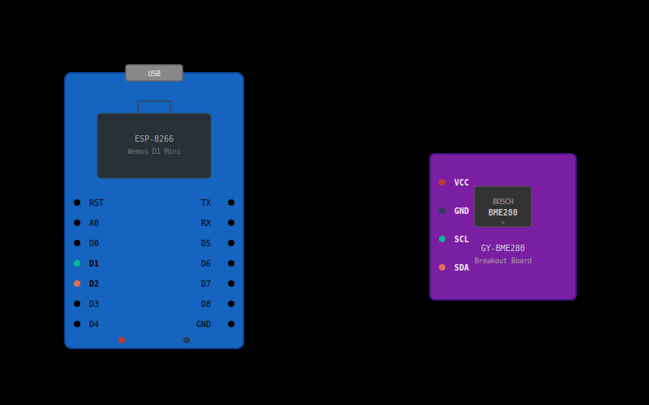

# BME280 / BMP280 Temperature Sensor Module

**Build flag:** `-DHAS_BME280`
**Mutually exclusive with:** `HAS_SHT30`
**Datasheet:** [Bosch BME280](../datasheets/bme280-datasheet.pdf)

## Overview

The BME280 module provides environmental sensing via a Bosch BME280 or BMP280 breakout board connected over I2C. The
firmware auto-detects which chip variant is present and adjusts its behavior accordingly.

### Metrics published

| Metric  | Unit | Notes                                 |
|---------|------|---------------------------------------|
| `temp`  | °C   | Always available                      |
| `humi`  | %    | BME280 only (0.0 reported for BMP280) |
| `press` | hPa  | Always available                      |

## Sensor Specifications

| Parameter               | BME280                           | BMP280          |
|-------------------------|----------------------------------|-----------------|
| Chip ID                 | `0x60`                           | `0x58`          |
| Temperature range       | -40 to +85 °C                    | -40 to +85 °C   |
| Temperature accuracy    | +/- 1.0 °C                       | +/- 1.0 °C      |
| Humidity range          | 0 to 100 %RH                     | N/A             |
| Humidity accuracy       | +/- 3 %RH                        | N/A             |
| Pressure range          | 300 to 1100 hPa                  | 300 to 1100 hPa |
| Pressure accuracy       | +/- 1.0 hPa                      | +/- 1.0 hPa     |
| Supply voltage          | 1.71 to 3.6 V                    | 1.71 to 3.6 V   |
| Supply current (normal) | 3.6 uA @ 1Hz                     | 2.7 uA @ 1Hz    |
| I2C address             | 0x76 (SDO=GND) or 0x77 (SDO=VDD) | same            |
| Interface               | I2C / SPI                        | I2C / SPI       |

## Wiring

### ESP8266 (Wemos D1 Mini)

| BME280 Pin | D1 Mini Pin | GPIO | Wire color |
|------------|-------------|------|------------|
| VCC        | 3V3         | —    | Red        |
| GND        | GND         | —    | Black      |
| SCL        | D1          | 5    | Green      |
| SDA        | D2          | 4    | Yellow     |



### Arduino MKR WiFi 1010

| BME280 Pin | MKR Pin | Notes               |
|------------|---------|---------------------|
| VCC        | VCC     | 3.3V from regulator |
| GND        | GND     | —                   |
| SCL        | SCL     | Default Wire SCL    |
| SDA        | SDA     | Default Wire SDA    |

On MKR, the default Wire pins are used — no explicit pin configuration is needed.

## Schematic


Key points from the schematic:

- **CSB** tied to VDD selects I2C mode (disables SPI)
- **SDO** tied to GND sets address `0x76`; tie to VDD for `0x77`
- **10k pull-up resistors** on SDA and SCL (often already present on breakout boards)
- **100nF decoupling capacitor** on VDD close to the chip

## BME280 vs BMP280 Auto-Detection

The driver reads the chip ID register (`0xD0`) at startup:

- `0x60` — BME280 detected: humidity oversampling enabled, 8 bytes read per cycle
- `0x58` — BMP280 detected: humidity registers skipped, 6 bytes read per cycle
- Any other value — `begin()` returns `false`, sensor not available

The `has_humidity()` method on `Bme280Sensor` reflects which variant was found.

## Firmware Configuration

The firmware uses oversampling x2 for temperature, x16 for pressure, x1 for humidity, with IIR filter
coefficient 16 and 1000ms standby in normal mode.

### Driver oversampling settings

| Measurement | Oversampling | Register         |
|-------------|--------------|------------------|
| Temperature | x2           | `CTRL_MEAS[7:5]` |
| Pressure    | x16          | `CTRL_MEAS[4:2]` |
| Humidity    | x1           | `CTRL_HUM[2:0]`  |

### IIR filter

Filter coefficient 16 (`CONFIG[4:2] = 0b100`). This smooths out short-term fluctuations in pressure
readings while keeping temperature responsive.

## Firmware Files

| File                                            | Role                                                                        |
|-------------------------------------------------|-----------------------------------------------------------------------------|
| `lib/thermo_drivers/src/bme280_sensor.h`        | Hardware driver class declaration                                           |
| `lib/thermo_drivers/src/bme280_sensor.cpp`      | I2C communication, compensation formulas (Bosch datasheet section 4.2.3)    |
| `lib/thermo_core/src/modules/bme280_module.h`   | Module registration and contribution function declarations                  |
| `lib/thermo_core/src/modules/bme280_module.cpp` | Registers metrics (`temp`, `humi`, `press`) and contributes to JSON payload |

## PlatformIO Environments Using This Module

Any environment with `-DHAS_BME280` in its `build_flags`:

- `sensor_8266_bmp80` — ESP8266 D1 Mini with BME280 + battery + deep sleep (production fleet)
- `sensor_c3_bme280_bh1750` — ESP32-C3 Super Mini with BME280 + BH1750 + battery + deep sleep
- `sensor_8266_empty` — ESP8266 D1 Mini with BME280 + serial debug (dev build)

The production ESP8266 env looks like this (a single image per `(HW_CODE, HW_REV)` serves the whole
fleet — there is **no** `-DDEVICE_ID`; identity is provisioned at runtime, see below):

```ini
[env:sensor_8266_bmp80]
extends = common_esp8266
build_flags =
    ${common_esp8266.build_flags}
    -DMQTT_DEVICE_TYPE='"thermo"'
    -DHW_CODE='"E8BMEBAT"'
    -DHW_REV=1
    -DHAS_BME280
    -DHAS_BATTERY
    -DHAS_DEEP_SLEEP
    -DHAS_CALIBRATION
    -DHAS_OTA
```

Build and upload with the real env name:

```bash
pio run -e sensor_8266_bmp80            # build
pio run -e sensor_8266_bmp80 -t upload  # upload
```

> **Identity (Stage B):** production images carry no compiled `device_id`. On first boot the device
> enters serial provisioning — assign its identity once with `provision <id>` (see
> [OTA](ota.md#first-provisioning)). `-DDEVICE_ID` survives only on dev builds (`-DHAS_SERIAL_DEBUG`)
> as a store seed. Per-device calibration is runtime too (config store + server mirror).

> **Note**: The MKR ENV Shield does **not** use a BME280 — it uses HTS221 + LPS22HB.
> Use `HAS_MKR_ENV` instead. See [mkr-env](mkr-env.md).

## See Also

- [Calibration](calibration.md) — per-device offset correction (recommended for cross-sensor consistency)
- [SHT30](sht30.md), [MKR ENV](mkr-env.md) — mutually exclusive alternative sensor modules
- [MQTT protocol](../mqtt-protocol.md) — metric names and payload format
- [Components inventory](../components.md) — BME/BMP280 hardware specs
- [Architecture](../architecture.md) — module system and feature flags
- Configs using this module: [ESP+BMP280+Battery](../configs/esp-bmp280-battery.md),
  [ESP32-C3+BME280+BH1750](../configs/esp32c3-bme280-bh1750.md)
