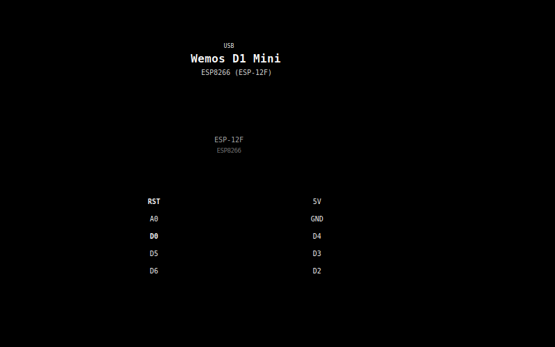

# Deep Sleep Module

## Overview

The deep sleep module puts the ESP8266 into its lowest power state between sensor readings. Instead of staying connected
to WiFi and polling on a timer, the device performs a **one-shot** cycle: wake, connect, read, publish, sleep. This
dramatically extends battery life for nodes powered by 18650 cells.

Enabled by the `-DHAS_DEEP_SLEEP` build flag. **Requires `-DHAS_BATTERY`** (battery-powered nodes only).

| Parameter              | Value                                        |
|------------------------|----------------------------------------------|
| Build flag             | `-DHAS_DEEP_SLEEP`                           |
| Dependency             | `HAS_BATTERY`                                |
| Default sleep interval | 300s (5 minutes)                             |
| Configurable range     | 1-86400s (via MQTT command)                  |
| Deep sleep current     | ~20uA (ESP8266) + ~55uA total                |
| Firmware files         | `src/hw/esp_sleep.h`, `src/hw/esp_sleep.cpp` |

## Hardware Requirement: GPIO16 to RST

The ESP8266 deep sleep wake-up mechanism requires a physical wire connecting **GPIO16 (D0)** to the **RST** pin on the
Wemos D1 Mini. When the internal RTC timer expires, GPIO16 pulls low, which resets the chip and starts a fresh boot
cycle.



> **Warning**: With D0 wired to RST, the serial upload may fail. Disconnect the D0-RST wire before flashing firmware,
> then reconnect it.

### Pin Connection

| From        | To  | Notes                                    |
|-------------|-----|------------------------------------------|
| D0 (GPIO16) | RST | Single jumper wire, required for wake-up |

## Execution Flow (One-Shot Mode)

Without deep sleep (normal mode), the device stays awake and publishes periodically:


With deep sleep, each cycle is a complete boot-to-sleep sequence:


Each wake cycle takes approximately 2-5 seconds depending on WiFi/MQTT connection time. The device is asleep for the
remaining duration of the interval.

## RTC Memory

The ESP8266 has a small region of RTC memory that survives deep sleep (but not power-off). The module uses this to
persist the publish interval across sleep cycles, so the device remembers a `set_interval` command without needing to
query the server every wake.

### RTC Data Structure

```c++
struct RtcData {
    uint32_t magic;           // 0xDEADBEEF = valid data
    uint32_t sleep_interval_s;
};
```

- **Magic value** (`0xDEADBEEF`): validates that RTC memory contains real data (not garbage after power-on).
- **RTC slot 64**: user memory area starts at byte 128 (slot 64). The module uses slot 64.
- On first boot (or after power loss), the magic check fails and the default interval (300s) is used.

### Interface

```c++
class ISleep {
public:
    virtual void deep_sleep(uint32_t seconds) = 0;
    virtual bool read_rtc_interval(uint32_t& interval_s) = 0;
    virtual void write_rtc_interval(uint32_t interval_s) = 0;
};
```

The concrete implementation `EspSleep` (in `src/hw/esp_sleep.cpp`) uses the ESP8266 SDK functions
`system_rtc_mem_read()` and `system_rtc_mem_write()`.

## Power Savings

| State              | Current Draw | Duration     | Notes                            |
|--------------------|--------------|--------------|----------------------------------|
| Deep sleep         | ~20uA        | 295-298s     | ESP8266 RTC timer only           |
| WiFi connect       | ~70mA        | 1-3s         | DHCP, association                |
| MQTT + sensor read | ~80mA        | 0.5-1s       | Publish + command wait           |
| WiFi TX peak       | ~350mA       | Milliseconds | Brief spikes during transmission |
| **Average (300s)** | **~0.5mA**   | --           | Dominated by sleep time          |

With a 2S pack of 2x 3000mAh 18650 cells and the [2S power supply module](power-2s.md), expected runtime at 300s
intervals:

```c++
3000 mAh / 0.5 mA ~ 6000 hours ~ 250 days
```

> **Note**: Actual runtime depends on cell age, temperature, self-discharge, and BMS quiescent current. Real-world
> results will be lower than the theoretical maximum.

## MQTT Integration

### Interval Configuration

The server can change the sleep/publish interval via the `command` topic:

```json
{
  "action": "set_interval",
  "value": 600
}
```

On receiving this command, the device:

1. Updates the publish interval in RAM.
2. Writes the new interval to RTC memory (persists across sleep cycles).
3. Enters deep sleep with the new interval.

### Retained Commands

Because the device is asleep most of the time, it cannot receive MQTT commands in real-time. The server should publish
commands with the **retain** flag. On each wake cycle, the device:

1. Connects to MQTT and subscribes to `{type}/{id}/command`.
2. Waits `MQTT_COMMAND_WAIT_MS` (2000ms) for retained messages.
3. Processes any received commands before publishing sensor data.

### Capabilities

The `request_capabilities` command is handled during the command wait window. The device responds with its capabilities
and then continues the normal publish-and-sleep cycle.

## PlatformIO Configuration

### Build Flags

```ini
build_flags =
    -DHAS_DEEP_SLEEP
    -DHAS_BATTERY    ; required dependency
```

### Example Environments

From `platformio.ini`:

```ini
[env:thermo_1]
platform = espressif8266
board = d1_mini
framework = arduino
build_flags =
    -Wall -Wextra
    -DDEVICE_ID=\"thermo_1\"
    -DMQTT_DEVICE_TYPE=\"thermo\"
    -DHAS_BME280
    -DHAS_BATTERY
    -DHAS_DEEP_SLEEP
```

## Firmware Files

| File                           | Role                                           |
|--------------------------------|------------------------------------------------|
| `src/hw/esp_sleep.h`           | `EspSleep` class declaration                   |
| `src/hw/esp_sleep.cpp`         | ESP8266 deep sleep + RTC memory implementation |
| `include/interfaces/i_sleep.h` | `ISleep` interface + `RtcData` struct          |
| `include/config.h`             | `DEFAULT_SLEEP_INTERVAL_S`, `RTC_MAGIC`        |
| `src/main.cpp`                 | `#ifdef HAS_DEEP_SLEEP` integration blocks     |

## Configuration Constants

| Constant                   | Value      | File            | Description                |
|----------------------------|------------|-----------------|----------------------------|
| `DEFAULT_SLEEP_INTERVAL_S` | 300        | `config.h`      | Default sleep duration (s) |
| `RTC_MAGIC`                | 0xDEADBEEF | `config.h`      | RTC memory validity marker |
| `RTC_SLOT`                 | 64         | `esp_sleep.cpp` | RTC memory slot number     |
| `MQTT_COMMAND_WAIT_MS`     | 2000       | `config.h`      | Retained command wait (ms) |

## See Also

- [Battery](battery.md) — required dependency for deep sleep mode
- [2S power supply](power-2s.md) — hardware power chain for battery nodes
- [MQTT protocol](../mqtt-protocol.md) — one-shot mode command handling
- [Architecture](../architecture.md) — continuous vs one-shot execution modes
- Configs using this module: [ESP+BMP280+Battery](../configs/esp-bmp280-battery.md),
  [ESP+SHT30+Battery](../configs/esp-sht30-battery.md)
